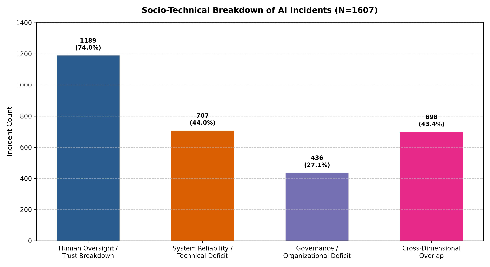
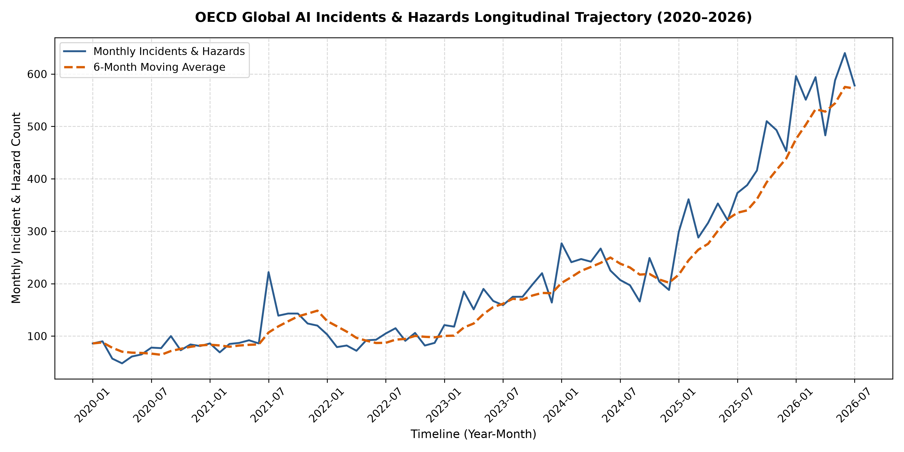

# Empirical Socio-Technical Analysis of Real-World AI Incidents


## Table of Contents

1. [Summary](#1-summary)
2. [Literature Synthesis](#2-literature-synthesis)
3. [Synthesis Matrix SME Barriers](#3-synthesis-matrix-sme-barriers)
4. [Empirical Dataset Analysis](#4-empirical-dataset-analysis)
   - [Micro-Level: AIID HTO Mapping](#micro-level-aiid-hto-mapping)
   - [Macro-Level: OECD Trajectories](#macro-level-oecd-trajectories)
5. [Repository Structure](#5-repository-structure)
6. [References](#6-references)


## 1. Summary

Investigating real-world socio-technical barriers in enterprise AI adoption by combining qualitative failure categorization with macro-level risk trajectory modeling to identify why deployed AI systems fail.

* **1. Literature Synthesis (The Theory):** 
  Synthesized 15 recent empirical studies (2019–2025) to establish a baseline of enterprise AI adoption barriers. Identified severe technical skill shortages, "black-box" trust breakdowns, legacy IT incompatibility, and ambiguous ROI as the primary bottlenecks preventing successful integration.

* **2. Empirical Dataset Analysis (The Reality):** 
  Engineered automated Python (Pandas) ETL pipelines to validate these theoretical barriers against real-world failures, processing 1,607 qualitative AIID logs and 16,737 OECD macro records (2020–2026).
  * **Micro-Level Mapping:** Applied regex-driven NLP heuristics within the Human-Technology-Organization (HTO) framework, proving that 74% of deployment failures are generated from human oversight and trust breakdowns, compared to 44% from system reliability, while 43.4% involve cross-dimensional overlap, and 27.1% from governance issues. 
  * **Macro-Level Trajectories:** Modeled multi-year risk trends showing a 7.67x surge in monthly AI incidents (75.0 to 575.7/month) while establishing a stable incident intensity rate.

## 2. Literature Synthesis (15 Studies, 2019–2025)

Prior literature evaluating artificial intelligence (AI) adoption across small and medium-sized enterprises (SMEs) and broader industrial contexts highlights a complex web of structural, technical, and behavioral barriers (Bettoni et al., 2021; Grünbichler, 2023; Hamm & Klesel, 2021). While AI presents transformational opportunities for operational efficiency, workflow automation, and predictive decision-making (Kramarenko, 2025; Rane et al., 2024; Schönberger, 2023), adoption rates in SMEs remain disproportionately low (Bettoni et al., 2021; Kramarenko, 2025). By synthesizing findings from recent empirical and conceptual research, the predominant adoption hurdles can be structurally mapped directly to the Human-Technology-Organization (HTO) socio-technical framework (Bérubé et al., 2021; Dondorf et al., 2025).

### A. Human Dimension: Skills, Trust, and Resistance
* Skill Shortages: A severe lack of internal talent, such as data scientists and AI engineers, makes it difficult for companies to build or manage AI models.

* Trust Issues: AI often operates as a "black box." When employees do not understand how AI makes decisions, they struggle to trust and adopt it in their daily workflows.

* Employee Resistance: The shift toward AI causes anxiety and fear of job loss, leading to pushback if organizational change isn't managed with proactive communication.

* Leadership Gaps: Leaders frequently misunderstand AI's true capabilities, resulting in unrealistic expectations, misaligned goals, and a lack of clear strategic direction.

### B. Technology Dimension: Data, Infrastructure, and Integration
* Poor Data Quality: AI requires massive amounts of clean data, but smaller organizations typically struggle with disorganized, missing, or siloed information.

* Legacy IT Systems: Outdated tech infrastructure lacks the computing power to support modern AI, making integration a major technical hurdle.

* Security Risks: Processing sensitive business and customer data through AI raises serious cybersecurity and privacy concerns.

* Unpredictable Results: Unlike standard software, AI relies on continuous, data-driven experimentation, making it hard to guarantee consistent performance.

### C. Organization Dimension: Financial and Governance Constraints
* High Costs: The upfront and ongoing expenses for software, scalable cloud infrastructure, and external consulting are often too steep for smaller budgets.

* Unclear ROI: Because AI projects are experimental, predicting their financial payoff is difficult. Businesses are hesitant to invest without guaranteed value.

* Governance & Compliance: Poor internal data rules and confusing external legal environments create roadblocks for safe and ethical AI deployment.

* Lack of Ready-Made Tools: Companies rarely have the resources to build custom AI, yet affordable, "off-the-shelf" solutions tailored to their specific industries are still hard to find.

------------------------

## 3. Synthesis Matrix SME Barriers

| HTO Dimension | Core Institutional Barriers | Source Validations |
| :--- | :--- | :--- |
| **Human** | Severe shortages in technical expertise and analytical skills. | (Bérubé et al., 2021; Bettoni et al., 2021; Grünbichler, 2023; Irman & Putra, 2025; Ulrich et al., 2021; Zavodna et al., 2024) |
| **Human** | Employee resistance, fear of job loss, and lack of systemic trust. | (Bérubé et al., 2021; Dondorf et al., 2025; Rane et al., 2024; Riedl, 2019) |
| **Human & Organization** | Absent leadership strategy and misunderstanding of AI business value. | (Bérubé et al., 2021; Grünbichler, 2023; Ulrich et al., 2021; Zavodna et al., 2024) |
| **Technology** | Poor data quality, limited data availability, and data silos. | (Bérubé et al., 2021; Bettoni et al., 2021; Grünbichler, 2023; Kramarenko, 2025; Ulrich et al., 2021; Zavodna et al., 2024) |
| **Technology** | Legacy IT incompatibility and insufficient computing infrastructure. | (Bérubé et al., 2021; Bettoni et al., 2021; Hamm & Klesel, 2021; Irman & Putra, 2025; Schönberger, 2023; Ulrich et al., 2021; Zavodna et al., 2024) |
| **Organization & Technology** | High initial implementation costs paired with ROI ambiguity. | (Bérubé et al., 2021; Bettoni et al., 2021; Grünbichler, 2023; Irman & Putra, 2025; Kramarenko, 2025; Schönberger, 2023; Ulrich et al., 2021; Zavodna et al., 2024) |
| **Organization & Technology** | Immature data governance, privacy risks, and legal/regulatory fears. | (Bérubé et al., 2021; Bettoni et al., 2021; Hamm & Klesel, 2021; Kramarenko, 2025; Rane et al., 2024; Schönberger, 2023) |

### Theoretical Synthesis 
The baseline literature (2019–2025) confirms that while technical deficits—such as poor data integration, incompatible legacy infrastructure, and algorithm unpredictability—represent the initial friction points for SMEs, the ultimate success of AI deployments pivots heavily on human and organizational factors (Bérubé et al., 2021; Dondorf et al., 2025). Overcoming these interconnected barriers requires moving beyond pure algorithmic development toward holistic socio-technical change management to build trust and align AI capabilities directly with enterprise strategy (Dondorf et al., 2025; Gumbo & Booyse, 2025; Riedl, 2019).

---

## 4. Empirical Dataset Analysis

This repository contains an end-to-end data processing and empirical research pipeline that categorizes real-world AI failures using the **Human-Technology-Organization (HTO) Socio-Technical Framework**.

### Micro-Level: AIID HTO Mapping

Using raw data from the **AI Incident Database (AIID)**, this project extracts, tags, and evaluates 1,607 documented incident records to understand why AI implementations fail in practice.

Source: AI Incident Database (AIID) Research Snapshot - https://incidentdatabase.ai/research/snapshots/
## Empirical Findings (N = 1,607)

| Socio-Technical Dimension | Incident Count | Percentage | Primary Indicators |
| :--- | :--- | :--- | :--- |
| **Human Oversight / Trust Breakdown** | **1,189** | **74.0%** | Operator error, automation bias, user mistrust, lack of training |
| **System Reliability / Technical Deficit** | **707** | **44.0%** | Model hallucinations, data leaks, system bugs, integration failures |
| **Governance / Organizational Deficit** | **436** | **27.1%** | Compliance non-conformance, shadow AI, missing corporate policy |
| **Cross-Dimensional Overlap** | **698** | **43.4%** | Incidents spanning 2 or more HTO dimensions simultaneously |



## Core Insight
While technical performance is often blamed for AI failure, empirical evidence shows that **74% of real-world AI incidents involve human factors and workflow integration failures**. Furthermore, 43.4% of breakdowns are multi-dimensional, requiring holistic socio-technical governance rather than simple model re-training.

### Macro-Level: OECD Trajectories

In addition to the qualitative HTO breakdown, a macro longitudinal analysis was conducted on the **OECD AI Incidents and Hazards Monitor (AIM)** dataset ($N = 16,737$ incidents across 79 months).

| Metric | 2020 Baseline | 2025 Peak | 2026 Trajectory (Jan–Jul) | Overall Shift |
| :--- | :--- | :--- | :--- | :--- |
| **Annual Incidents** | 900 | 4,571 | 4,030 (7 months) | **5.0x increase** |
| **Avg. Monthly Incidents** | 75.0 / month | 380.9 / month | 575.7 / month | **7.7x surge** |
| **Incident Rate per 1k AI Events** | 27.65 | 25.85 | 26.84 | **Stable proportion** |



### Key Takeaways
1. **Accelerating Failure Frequency:** Monthly AI incident reports expanded 7.67x between 2020 and 2026, demonstrating that risk exposure scales alongside adoption velocity.
2. **Linear Growth Rate:** The constant incident intensity rate (~26 incidents per 1,000 AI news events) indicates that failure occurrence is systematically tied to deployment scale, reinforcing the necessity of automated socio-technical governance frameworks.

Source: OECD AI Incidents and Hazards Monitor (AIM) - https://oecd.ai/en/incidents?search_terms=%5B%5D&and_condition=false&from_date=1900-08-11&to_date=2026-08-11&properties_config=%7B%22principles%22:%5B%5D,%22industries%22:%5B%5D,%22harm_types%22:%5B%5D,%22harm_levels%22:%5B%5D,%22harmed_entities%22:%5B%5D,%22business_functions%22:%5B%5D,%22ai_tasks%22:%5B%5D,%22autonomy_levels%22:%5B%5D,%22languages%22:%5B%5D%7D&order_by=date&num_results=20

## 5. Repository Structure

```text
├── data/
│   ├── raw/                 <-- Raw AIID snapshot export (.xlsx)
│   └── processed/           <-- Tagged dataset (.csv) & generated chart (.png)
├── 01_ingest_incidents.py   <-- API data fetching script
├── 02_parse_and_code.py      <-- HTO categorization pipeline
└── 03_analyze_data.py       <-- Statistical evaluation & chart generation


## Getting Started

### Prerequisites
Clone this repository and ensure Python 3.9+ is installed. Install the required dependencies:

```bash
pip install pandas openpyxl matplotlib requests

## Execution Pipeline

1. Setup Data: Ensure the raw Excel export (AIID__Excel__Export-20260803.xlsx) is placed inside data/raw/ (or run python 01_ingest_incidents.py to fetch data via API).

2. Process & Tag Dataset: Run the HTO classification pipeline to parse raw incident text and assign socio-technical tags: python 02_parse_and_code.py

3. Generate Analytics & Charts: Compute statistical distributions and output the visualization: python 03_analyze_data.py

4. Outputs will be saved directly to data/processed/ai_incidents_tagged.csv and data/processed/hto_distribution_chart.png.

```

## 6. References

*   Bellahmar, H., Souidi, D., Bellahmar, A., Ouessai, R., Habibi, Z., & Mokhtari, H. (2025). The reality of artificial intelligence within small and medium enterprises in Algeria, a prospective study. *South Florida Journal of Development, 6*(5), 1-19.
*   Bérubé, M., Giannelia, T., & Vial, G. (2021). Barriers to the Implementation of AI in Organizations: Findings from a Delphi Study. *Proceedings of the 54th Hawaii International Conference on System Sciences*, 6702-6711.
*   Bettoni, A., Matteri, D., Montini, E., Gładysz, B., & Carpanzano, E. (2021). An AI adoption model for SMEs: a conceptual framework. *IFAC PapersOnLine, 54*(1), 702-708.
*   Dondorf, V., Happe, L., Hobscheidt, D., Kürpick, C., & Dumitrescu, R. (2025). Evaluation Of The Challenges In Implementing AI Across The Different Phases - Empirical Insights Derived From AI Implementation Projects In Industry. *CPSL 2025*, 207-220.
*   Grünbichler, R. (2023). Implementation Barriers of Artificial Intelligence in Companies. *Graz University of Technology*, 193-203.
*   Gumbo, L., & Booyse, N. J. (2025). Artificial Intelligence Implementation Strategies in Business: A Systematic Review. *Business Excellence and Management, 15*(5), 92-110.
*   Hamm, P., & Klesel, M. (2021). Success Factors for the Adoption of Artificial Intelligence in Organizations: A Literature Review. *AMCIS 2021 Proceedings*, 1-10.
*   Irman, D., & Putra, D. (2025). AI Adoption in Business: Opportunities and Challenges for Start-ups. *International Journal of Business, Economics and Social Development, 6*(1), 99-104.
*   Kramarenko, A. (2025). Artificial Intelligence for Small and Medium Business: Perspectives and Challenges. *Journal of Engineering Management and Competitiveness, 15*(1), 43-56.
*   Rane, N. L., Choudhary, S. P., & Rane, J. (2024). Acceptance of artificial intelligence: key factors, challenges, and implementation strategies. *Journal of Applied Artificial Intelligence, 5*(2), 50-70.
*   Riedl, M. O. (2019). Human-centered artificial intelligence and machine learning. *Human Behavior and Emerging Technologies, 1*, 33-36.
*   Schönberger, M. (2023). Artificial Intelligence for Small and Medium-Sized Enterprises: Identifying Key Applications and Challenges. *Journal of Business Management, 21*, 89-112.
*   Ulrich, P., Frank, V., & Kratt, M. (2021). Adoption of artificial intelligence technologies in German SMEs — Results from an empirical study. *Virtus*, 76-84.
*   Vial, G., Cameron, A.-F., Giannelia, T., & Jiang, J. (2023). Managing artificial intelligence projects: Key insights from an AI consulting firm. *Information Systems Journal, 33*, 669-691.
*   Zavodna, L. S., Überwimmer, M., & Frankus, E. (2024). Barriers to the implementation of artificial intelligence in small and medium-sized enterprises: Pilot study. *Journal of Economics and Management, 46*, 331-352.
------------------------------------------------------------------------------


